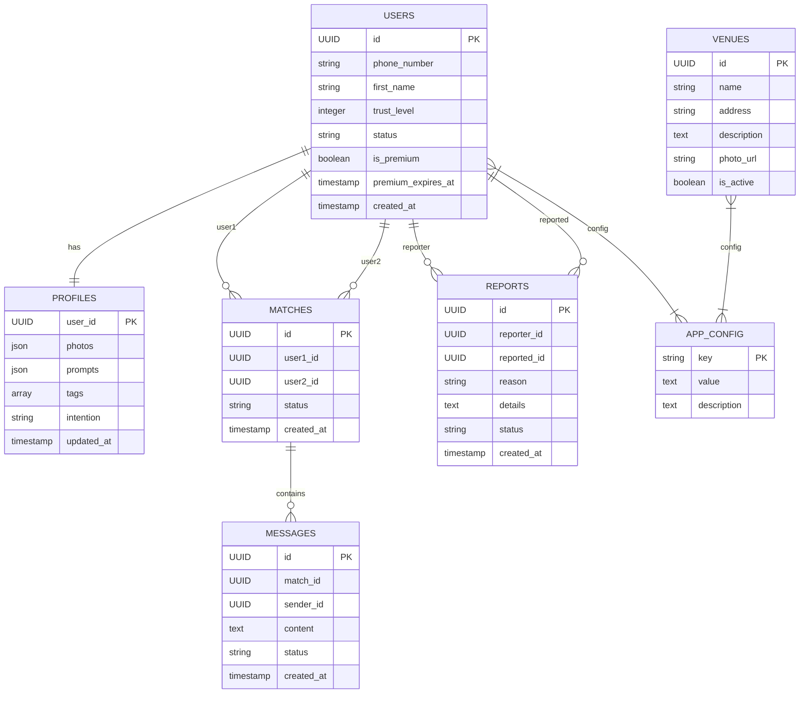

# Architecture Technique Nexus 4.0

## 1. Vue d'ensemble

Nexus 4.0 est une plateforme de rencontres conçue selon une architecture découplée en quatre services principaux :

1. **Nexus PWA** : L'application frontend utilisateur
2. **Nexus Core API** : Le backend qui gère la logique métier
3. **Nexus Superadmin Dashboard** : L'interface de contrôle total
4. **Base de données PostgreSQL** : Le système de stockage relationnel

## 2. Architecture système

### 2.1. Schéma des composants

```
[ UTILISATEUR ]
      |
      | <--- (HTTPS/WSS) ---> [ Nexus PWA (Frontend) ]
      |                              |
[SUPERADMIN]                        |
      |                              |
      | <--- (HTTPS) ---> [ Nexus Superadmin Dashboard ]
      |                              |
      | <--------------------------> |
      |                              |
      | <--- (HTTPS) ---> [ Nexus Core API (Backend) ]
                                     |
                                     |
                                     | <--- (PostgreSQL) ---> [ Base de Données ]
```

### 2.2. Principe "Configuration-Driven"

L'application PWA est un "client léger intelligent" qui ne contient aucune logique métier ou texte en dur. Au démarrage et périodiquement, elle appelle l'endpoint `GET /api/v1/config` qui retourne un objet JSON contenant toute la configuration de l'expérience utilisateur :

- Textes & Labels
- Paramètres du Moteur
- Feature Flags
- Règles de Validation

### 2.3. Stratégie de Cache Hors-Ligne

L'application suit le principe "Offline-First" avec :

#### 2.3.1. Base de Données Locale (IndexedDB)
La PWA utilise IndexedDB comme source de vérité primaire pour l'interface utilisateur.

#### 2.3.2. Cache des Conversations (90 Jours)
- À la première connexion : téléchargement et stockage local de l'historique des messages des 90 derniers jours
- En ligne : synchronisation en temps réel via WebSockets
- Hors ligne : lecture complète de l'historique mis en cache

#### 2.3.3. Cache de Découverte (24 Heures)
- Pré-chargement périodique des profils pour les deux modes de découverte
- Stockage local des profils et photos compressées
- Navigation fluide même sans connexion

#### 2.3.4. Synchronisation Intelligente
Un Service Worker gère la synchronisation :
- Détection du retour de connectivité réseau
- Envoi des actions en file d'attente vers l'API
- Récupération des nouvelles données de l'API
- Mise à jour automatique de l'interface utilisateur

## 3. Technologies utilisées

### 3.1. Nexus PWA (Frontend)
- **Framework** : React avec Vite
- **Gestion d'état** : Context API
- **Stockage hors-ligne** : IndexedDB
- **Temps réel** : WebSockets
- **Routing** : React Router
- **Styling** : CSS Modules ou Tailwind CSS

### 3.2. Nexus Core API (Backend)
- **Langage** : Node.js
- **Framework** : Express.js
- **Authentification** : JWT (JSON Web Tokens)
- **Validation** : Joi ou express-validator
- **Documentation** : Swagger/OpenAPI
- **Tests** : Jest

### 3.3. Nexus Superadmin Dashboard
- **Framework** : React avec Vite
- **UI Library** : Material-UI ou Ant Design
- **State Management** : Redux ou Context API

### 3.4. Base de données
- **SGBD** : PostgreSQL
- **ORM** : Sequelize ou Prisma
- **Migration** : db-migrate ou sequelize-cli

## 4. Structure des données

### 4.1. Modèle Entité-Relation



## 5. API Endpoints

### 5.1. Authentification
- `POST /api/v1/auth/login` - Envoyer le code SMS
- `POST /api/v1/auth/verify` - Vérifier le code et générer le JWT
- `POST /api/v1/auth/refresh` - Rafraîchir le token JWT

### 5.2. Configuration
- `GET /api/v1/config` - Récupérer la configuration de l'application
- `PUT /api/v1/config` - Mettre à jour la configuration (Superadmin)
- `DELETE /api/v1/config` - Réinitialiser la configuration (Superadmin)

### 5.3. Utilisateurs
- `GET /api/v1/users/me` - Récupérer le profil de l'utilisateur courant
- `PUT /api/v1/users/me` - Mettre à jour le profil de l'utilisateur courant
- `POST /api/v1/users/me/photos` - Ajouter une photo de profil
- `DELETE /api/v1/users/me/photos/:id` - Supprimer une photo de profil
- `POST /api/v1/users/me/verify` - Soumettre la vérification vidéo

### 5.4. Découverte
- `GET /api/v1/discovery/feed` - Flux de découverte infini
- `GET /api/v1/discovery/priorities` - Deck quotidien curaté
- `POST /api/v1/discovery/actions` - Actions de découverte (like, pass)

### 5.5. Matchs et Messages
- `GET /api/v1/matches` - Liste des matchs
- `GET /api/v1/matches/:id/messages` - Messages d'un match
- `POST /api/v1/matches/:id/messages` - Envoyer un message
- `POST /api/v1/matches/:id/unmatch` - Dissoudre un match

### 5.6. Sécurité
- `GET /api/v1/safety/venues` - Liste des lieux sûrs
- `POST /api/v1/safety/reports` - Signaler un utilisateur
- `POST /api/v1/safety/guardian` - Définir l'ange gardien

### 5.7. Monétisation
- `GET /api/v1/premium/plans` - Liste des plans premium
- `POST /api/v1/premium/subscribe` - S'abonner à un plan
- `POST /api/v1/premium/cancel` - Annuler l'abonnement

### 5.8. Superadmin
- `GET /api/v1/admin/users` - Liste des utilisateurs
- `GET /api/v1/admin/users/:id` - Détails d'un utilisateur
- `PUT /api/v1/admin/users/:id` - Modifier un utilisateur
- `DELETE /api/v1/admin/users/:id` - Supprimer un utilisateur
- `GET /api/v1/admin/reports` - Liste des signalements
- `PUT /api/v1/admin/reports/:id` - Traiter un signalement
- `GET /api/v1/admin/venues` - Liste des lieux sûrs
- `POST /api/v1/admin/venues` - Ajouter un lieu sûr
- `PUT /api/v1/admin/venues/:id` - Modifier un lieu sûr
- `DELETE /api/v1/admin/venues/:id` - Supprimer un lieu sûr

## 6. Sécurité

### 6.1. Authentification et Autorisation
- Authentification par JWT avec refresh token
- Protection contre les attaques CSRF
- Rate limiting pour prévenir les abus
- Validation stricte des entrées utilisateur

### 6.2. Protection des Données
- Chiffrement des données sensibles
- Hachage des mots de passe
- Séparation des environnements (dev, staging, prod)
- Sauvegardes régulières de la base de données

### 6.3. Sécurité des Communications
- HTTPS obligatoire
- Headers de sécurité (HSTS, CSP, etc.)
- WebSockets sécurisés (WSS)

## 7. Performance et Scalabilité

### 7.1. Optimisations Frontend
- Code splitting
- Lazy loading
- Mise en cache HTTP
- Compression des ressources

### 7.2. Optimisations Backend
- Indexation appropriée de la base de données
- Pagination des résultats
- Mise en cache des données fréquemment utilisées
- Pooling de connexions à la base de données

### 7.3. Scalabilité
- Architecture sans état (stateless)
- Conteneurisation avec Docker
- Orchestration avec Kubernetes
- Load balancing

## 8. Déploiement

### 8.1. Environnements
- **Développement** : Environnement local pour le développement
- **Staging** : Environnement de test avant mise en production
- **Production** : Environnement de production

### 8.2. CI/CD
- Intégration continue avec GitHub Actions ou GitLab CI
- Tests automatisés
- Déploiement automatique sur les environnements

### 8.3. Monitoring
- Logging centralisé
- Monitoring des performances
- Alerting en cas d'erreurs
- Suivi des métriques métier

## 9. Maintenance

### 9.1. Mises à jour
- Mises à jour de sécurité régulières
- Suivi des dépendances avec des outils comme Dependabot
- Tests de régression avant chaque mise à jour

### 9.2. Sauvegardes
- Sauvegardes automatiques quotidiennes de la base de données
- Sauvegardes des fichiers statiques
- Plans de reprise après sinistre

## 10. Documentation

### 10.1. Documentation Technique
- Ce document d'architecture
- Documentation de l'API (Swagger/OpenAPI)
- Documentation du code (JSDoc, TSDoc)

### 10.2. Documentation Utilisateur
- Guide utilisateur pour l'application PWA
- Guide Superadmin pour le Dashboard
- FAQ et guides de dépannage

Cette architecture permet de créer une plateforme robuste, évolutive et entièrement configurable par le Superadmin, conformément au Blueprint Nexus 4.0 Édition Titan.